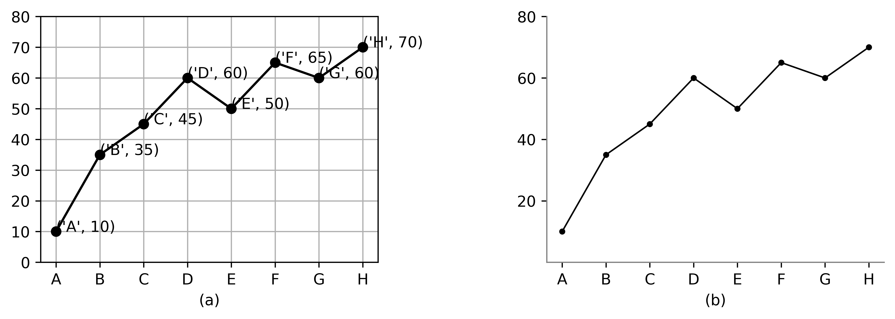

# 
Improvements of Bad Visualization on Machine Learning

## Abstract

When we want to explain something to others, visualization is convenient and important. But if the visualization is bad, the result is often counterproductive and misleading to the readers. It may be difficult for readers to easily capture the key information and misunderstand. A good article needs good visualization to present information. However, many authors cannot make good visualization because they do not understand the guidelines of visualization. We found a bad data visualization chart in a good literature, and discussed its significance and social impact. At the same time, it also points out the shortcomings of this picture, and gradually modifies it to improve its readability.

## Introduction

The same data can produce different data visualizations, and different data visualizations have different effects on readers' understanding. Excellent data visualization can usually convey information efficiently and accurately. However, some poor data visualization may confuse readers. In many cases, if you only observe the data, you can finally get the expected conclusions, but this is a difficult and long process, because there are multiple methods and parameters. But if we display the data in the form of visual charts, we can observe the results clearly and intuitively.

Article [*TPGNN: Learning High-order Information in Dynamic Graphs via Temporal Propagation*](https://arxiv.org/pdf/2210.01171.pdf) proposes a new algorithm TPGNN, which is an upgrade of GNN. GNN is a hot machine learning algorithm, and TPGNN based on this algorithm is a valuable research direction.

The following visualization (see Figure 1) shows the influence of the number of parameters passed to the training program on the average accuracy of different methods. And it is the *Figure 5* of the article.

  </img>
   
  <b>Figure 1.</b> Bad visualization on machine learning.

Obviously, the author hopes to compare TPGNN with other algorithms to explore whether TPGNN is excellent. By comparing various data, we can clearly see that the average accuracy of TPGNN is higher than that of other methods, and it is relatively stable. Although information can be obtained through this visualization, it is a poor visualization. There are too many unnecessary factors in the diagram, which makes the diagram look messy and untidy. They should be deleted. The coordinate axis of the figure is discontinuous. How can the reader analyze the difference between polylines through a truncated coordinate axis? At the same time, the position of the legend is very bad and needs to be adjusted, and the style of the polyline is also chaotic and useless, so it is necessary to unify it.

## Setting of Improvements

It is said in the article that the precision of some existing models will decline with the increase of the number of processing parameters. In order to observe the performance of the new algorithm TPGNN in this respect, the author conducted experiments. The author used five algorithms: TPGNN, APAN, TGN, TGAT, JODIE to calculate their average prediction precision under different batch sizes on Wikipedia in terms of link prediction, and judged whether the algorithm is sensitive to the batch size according to the change of average precision. 
TPGNN is upgraded on the basis of GNN algorithm. It is temporal propagation-based graph neural network that remedies two deficiencies in learning high-order information for temporal graphs: computational inefficiency and over-smoothing. For us, TPGNN algorithm has played a great role in the research of node classification, point cloud and automatic programming.

There are five color polylines in the chart, representing different algorithms. The x-axis represents the batch sizes transmitted to the program, and the y-axis represents the average precision of the algorithm. If the polyline is gentle, the algorithm corresponding to the polyline is not affected by the batch size. On the contrary, if the polyline is more zigzag, the algorithm is more affected by the Batch size. The author mainly observed the polyline of TPGNN, which is orange. It can be seen that the polyline is the top of all polylines, and it is relatively gentle, which indicates that TPGNN has high prediction precision and its prediction ability is not greatly affected by the batch size. It can be seen that the average accuracy of TPGNN is significantly higher than TGAT and JPDIE, slightly higher than TGN and APAN, and is less affected by A than these algorithms. So, the newly proposed method TPGNN, does have advantages over previous methods. It is possible to solve two defects in time graph high-order information learning.

But unfortunately this is a poor visualization. A good article needs not only high-quality content ans ideas, but good visualization. So, here we select this chart for analysis and improvement to make it an excellent visualization.

## Specific Improvements

The following is the specific improvement of the chart, which is divided into three steps. The diagram of each step of modification is also shown. The final result will be presented in the following part.

### Erase Non-Data-Ink

The Data-Ink ratio is a concept that introduced by Edward Tufte, the expert whose work has contributed significantly to designing effective data visualization. Tufte refers to data-ink as the non-erasable ink used for the presentation of data. If data-ink would be removed from the image, the graphic would lose the content. Non-Data-Ink is accordingly the ink that doesn't transport the information but it is used for scales, labels and edges. The data-ink ratio is the proportion of ink that is used to present actual data compared to the total amount of ink used in the entire visualization.

**Data-Ink ratio = data-ink / total-ink**

Create an excellent visualization requires maximizing the data-ink ratio. That means every bit of ink should be to present new information. This has three advantages: clear message, saving time and saving space. Maximizing the data-ink ratio will make message clearer and easier to consume by audience, and fewer accessory elements mean less confusion and more effective reading. Moreover, if you need to show a lot of information in a dashboard, space is a resource. Data-ink optimized charts occupy less space and accept resizing better. So, a good visualization requires erase Non-Data-Ink.

For example in Figure 2a and Figure 2b, remove grid lines and any call-outs, labels or borders that aren't necessary for getting the point of the chart, and reduce the thickness of graphic elements.

  </img>
   
  <b>Figure 2.</b> An example of improving Data-Ink ratio benefits. (a) A poor visualization. (b) Clear visualization after erase Non-Data-Ink.
 

The visualization discussed in this article has a lot of Non-Data-Ink elements, such as borders and grid lines. After removing these elements (see Figure 3), the readability of visualization is improved.

  </img>
   
  <b>Figure 3.</b> The visualization after remove Non-Data-Ink elements.

Of course, the line chart still needs to be improved. In order to distinguish different algorithms, the author chooses different styles of polylines and points. But these are not necessary, because readers can clearly distinguish different algorithms through different colors. If the style of all polylines is unified into solid lines, and the style of all points is unified into small cycle dots (see Figure 4), it will not affect readers' reading, and the Data-Ink ratio will be improved.

  </img>
   
  <b>Figure 4.</b> The visualization after adjust the style of polylines and points.

### Axes Labelled

There is no doubt about what an axis represents in the chart. The quality of axes setting directly affects the readability of visualization. Therefore, the axes should be clear and concise in the process of setting, and try not to use too many styles. Remember that visualization variables are only used for data variation. When establishing the axes, it is necessary to prevent readers from misunderstanding. For example, state the units of measurement, use two‐dimensional designs, set only one x-axis and one y-axis. They all are good ways to prevent misunderstanding.

The axes of the  line chart discussed in this article has a big problem: the y-axis is discontinuous. It can be speculated that the author deleted a section without data to make the arrangement of polylines more compact, but this will make readers misunderstand the differences between different polylines. Obviously, the difference between the above three algorithms and the following two algorithms is large, but the visualization used by the author narrows the difference between them, so the y-axis should be adjusted to a continuous one (see Figure 5). Meanwhile, the scale of y-axis is adjusted to improve Data-Ink ratio.

  </img>
   
  <b>Figure 5.</b> The visualization after continuous y-axis.

### Cognitive Tunneling

Cognitive tunneling is the psychological state in which your brain hangs on to the thing that is closest to you or in front of you, and does not see the rest of the environment or relevant data. What does this mean? For example in Figure 6a, when readers see this chart, they may be attracted by the ice cream pattern in the chart at the first time, thus ignoring the data. This is caused by cognitive tunneling.

  </img>
   
  <b>Figure 6.</b> An example of cognitive theory. (a)Visualization that does not conform to cognitive theory. (b) Modified visualization

Therefore, the chart after removing the ice cream pattern is more consistent with the cognitive theory, see Figure 6b. People's attention is limited, so when establishing visualization, attention should be paid to prevent useless information from attracting readers' attention, and important information should be marked to attract readers' attention.

In the figure discussed in this discussion, the legend accounts for a large proportion, so the legend may cause the reader to fall into a cognitive tunnel. However, we know that the information that the author hopes to transmit is that the average accuracy of TPGNN algorithm is high and stable. So we can delete the legend, mark the algorithm directly behind each polyline, mark the font size of TPGNN algorithm, and rotate the label of y-axis (see Figure 7). This can not only prevent cognitive tunneling, but also distinguish the target algorithm from other algorithms, which is easier to attract attention.

<b>Figure 7.</b> The visualization after adjust the legend and label.

## Analysis of the Final Chart

In the final visualization, the chart is presented in the most concise and clear way, without redundant borders, backgrounds and annotations. Moreover, the whole axes are continuous, and the advantages of TPGNN algorithm at the top are shown in a more explicit way. In addition, the name of the algorithm is marked at the end of each polyline, and TPGNN is marked with larger font, which is more consistent with human cognitive theory.

## Conclusion

Visualization is important. We hope that readers can understand the guidelines for building excellent visualization. A good visualization should be clear and concise, without useless borders, backgrounds and annotations. which requires maximizing the data-ink ratio. And the coordinate axis is very important. The x-axis and y-axis should be unique and clear. And visualization should conform to human cognitive theory, and unimportant information should not occupy a prominent position. If readers can make better use of them in their own visualization after reading this article, we will be very glad to see the result.
